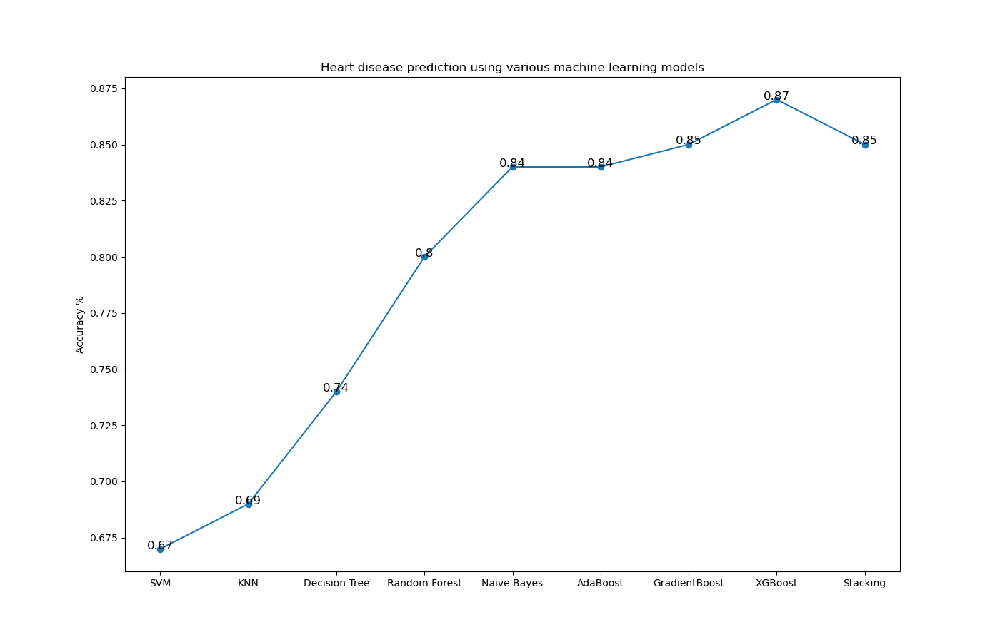

# Project: Heart Disease Prediction - Dự đoán khả năng bị bệnh tim
- Project này áp dụng các phương pháp học máy cơ bản để dự đoán 1 người có khả năng mắc bệnh tim hay không dựa trên tập dữ liệu về bệnh tim ***Cleveland dataset*** từ [UCI Machine Learning Repository](https://archive.ics.uci.edu/datasets). 
- Tập dữ liệu Cleveland gồm 14 thông tin: 
    - ***Age***: tuổi
    - ***Sex***: Giới tính
    - ***Chest-pain type - CP***: trạng thái đau ngực
    - ***Resting Blood Pressure - Restbps***: Huyết áp khi nghỉ ngơi
    - ***Serum Cholestrol - Chol***: Nồng độ cholesterol trong huyết thanh
    - ***Fasting Blood Sugar - Fbs***: chỉ số đường nhanh trong máu
    - ***Resting ECG - restecg***: kết quả điện tâm đồ khi nghỉ ngơi
    - ***Max heart rate achieved - thalach***: Nhịp tim tối đa
    - ***Exercise incluced angina - Exang***: có bị đau thắt ngực khi tập thể dụng hay không
    - ***ST depression induced by exercise relative to rest - Oldpreak***:  chỉ số ST lúc tập thể thao so với lúc thư giãn
    - ***Peak exercise ST segment - slope***: chỉ số ST trong lúc hoạt động gắng sức
    - ***Number of major vessels (0–3) colored by flourosopy - ca***:  Số lượng mạch chính (gồm động mạch, mao mạch và tĩnh mạch) được phát sáng thông qua nội soi huỳnh quang
    - ***displays the thalassemia - Thal***:  thiếu máu tán huyết bẩm sinh
    - ***Diagnosis of heart disease - Target***: thông tin có bị bệnh tim hay không ( 0 đại điện cho bệnh nhân không có bệnh, và 1,2,3,4 đại diện cho bệnh nhân có bệnh)

- Project này sử dụng các giải thuật máy học như: ***naive bayes, k nearest neigbors (KNN), decision tree, random forest, Adaboost, gradient boost, XGBoost và support vector machine (SVM)***
- Dưới đây là kết quả so sánh accuracy giữa các models: 
